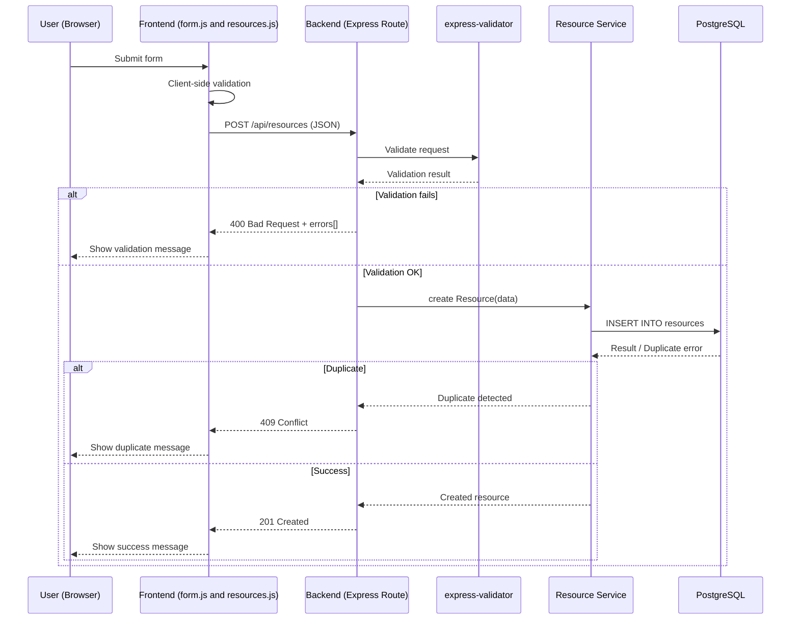
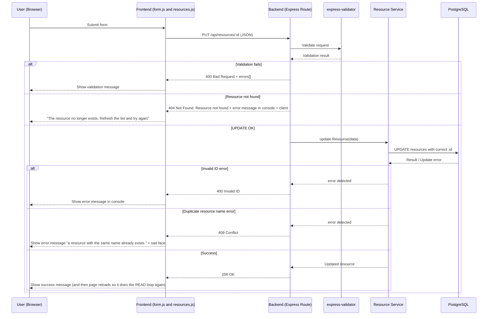
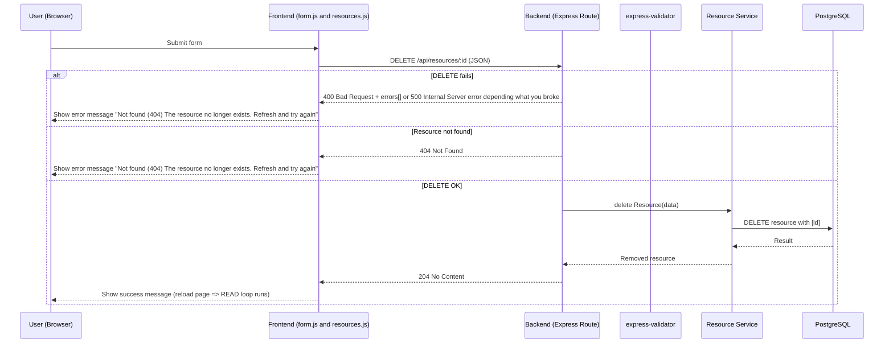

# 1️⃣ CREATE – RResource (Sequence Diagram)



# 2️⃣ READ — Resource (Sequence Diagram)

```mermaid
sequenceDiagram
    participant U as User (Browser)
    participant F as Frontend (form.js and resources.js)
    participant B as Backend (Express Route)
    participant V as express-validator
    participant S as Resource Service
    participant DB as PostgreSQL

    U->>F: Page reload requests data
    F->>B: GET /api/resources (JSON)
    B->>DB: Request for data

    alt Get fails
        B-->>F: 500 Internal Server Error + errors[]
        F-->>U: Show error in console if request failed
    else Get OK
        DB->>B: Gives the data (JSON)

        alt Resource not modified (cached)
            B-->>F: 304 Not Modified
            F-->>U: Use cached data; shows the existing resources
        else Resource modified
            B-->>F: 200 OK + data
            F-->>U: Shows the existing resources
        end
    end
```

# 3️⃣ UPDATE — Resource (Sequence Diagram)



# 4️⃣ DELETE — Resource (Sequence Diagram)


